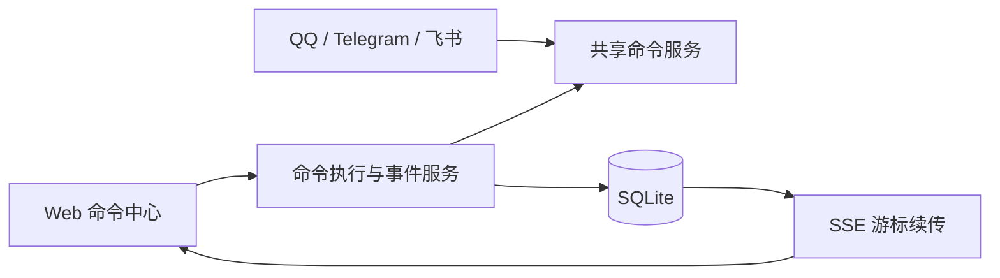
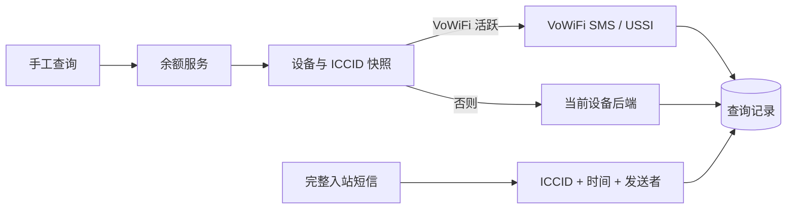

# Web 命令中心与余额查询施工交工单

独立性：strong，由主执行会话直接派生的只读 reviewer 审查；当前版本仍有待修项。

## 总结

这轮已经搭出了可运行的命令中心后端、余额状态机、Web 页面和生产装配。共享命令、SQLite 时间线、SSE、五分钟余额等待、VoWiFi/当前后端二选一路由、原文与结构化余额保存等核心后端能力已经接通。不过批准的 API 地址、部分前端交互和证据记录还没有完全对齐，暂时不能按原方案交工。

## spec 目标逐条对账

| spec 目标 | 状态 | 实际效果 | 备注 |
|---|---|---|---|
| Web 与 QQ、Telegram、飞书共用十个斜杠命令 | 完成 | Web 和通知渠道调用同一组命令处理器 | 生产装配使用同一个命令服务 |
| 命令结果、过程和历史持久化，并通过 SSE 实时更新 | 完成 | 事件写入 SQLite，刷新可分页读取，断线可按事件 ID 续传 | 清理历史保留运行中的执行 |
| SMS/USSD 沿当前 VoWiFi 或设备后端发送 | 完成，未做运营商实发 | VoWiFi 活跃时只走 VoWiFi，否则走当前后端 | 服务层不切射频、不打开蜂窝、不自动重试 |
| 同一 ICCID 只允许一条查询，并在五分钟内关联完整回复 | 部分完成 | 并发、超时和完整短信过滤已实现 | 自定义规则仍可保存空发送者列表 |
| 同时保存结构化余额和运营商原文 | 完成 | 金额、币种、摘要和原文都会保存；解析失败明确显示未解析 | 页面可同时查看摘要和原文 |
| 覆盖 16 个运营商预设，资料不足就明确不支持 | 部分完成 | 16 个 MCC/MNC 都有条目，多个不确定规则已标为不支持 | CTExcel 的实机证据等级需要校准 |
| 内置规则只读，自定义规则可覆盖并使用 Go RE2 | 部分完成 | 内置表防御性复制，自定义规则可增删改，非法正则会被拒绝 | API 地址与批准文档不一致 |
| 提供独立、响应式、可访问的命令中心页面 | 部分完成 | 已有时间线、余额状态、补全、危险确认和规则编辑 | 左右布局、移动顺序、安全区和普通命令设备选择待修 |
| 所有新 API 使用 Bearer 鉴权并写入 OpenAPI | 部分完成 | 当前注册的新路由均在鉴权中间件后 | 路径和部分方法不是批准清单 |
| 构建 Linux amd64 包并做无副作用远端冒烟 | 已执行，证据待固化 | 新包已部署且服务、API、SSE、设备状态通过实测 | 需要把脱敏原始输出保存进仓库 |
| 未经再次授权不发送真实 CTExcel/giffgaff 查询 | 完成 | 本轮没有发起余额短信或 USSD | 测试只执行了 `/help` |

## 施工细节

### 共享命令与时间线

`internal/notify/command_service.go` 维护十个命令。通知管理器把同一组处理器注册给 QQ、Telegram、飞书等渠道，Web 命令中心也复用这一实例。Web 命令先写入 running 执行和 accepted 事件，再调用处理器；结果继续写入 SQLite 并推送给 SSE 客户端。

你在 Web 输入 `/help` 后，系统会先显示已受理，再把共享命令服务生成的帮助文本写入时间线；刷新页面仍能看到这次执行。

### 余额状态机与短信关联

查询先读取设备、ICCID 和 VoWiFi 状态。VoWiFi 活跃时，SMS 只调用 VoWiFi 发送，USSD 只调用 USSI；否则调用设备当前后端。系统不会为查询改变飞行模式或网络策略，也没有失败后换链路的重试。

查询最多等待五分钟。同一 ICCID 已有查询时，新请求会明确冲突。完整回复到达后，原文总会保存；匹配不到金额时状态仍是已完成，但标记为未解析。

当前规则编辑器允许把回复发送者留空，这种配置会真的发出请求，却无法关联任何回复。后续修复必须在发送前拒绝该配置。

### API 与页面

实际新路由都在 Bearer 鉴权后，并有 OpenAPI 描述。不过代码使用 `/api/commands/*` 和 `/api/balance/*`，与批准方案中的 `/api/command-center/*`、设备作用域查询和 `/api/carrier-query-rules` 不一致。按照批准文档调用会得到 404。

页面已经具备事件时间线、历史翻页、清理、余额面板、斜杠补全、危险动作确认、自定义规则编辑和 SSE 重连。桌面左右栏与方案相反；移动端余额区没有置顶，输入区也没有避开底部安全区域。普通设备命令点选后仍要手工补设备 ID。

### 运营商规则与证据

内置表覆盖 16 个 MCC/MNC。资料不足的 CSL、O2 DE、Spark NZ、Three HK、Three UK 等已经明确标成不支持，并提供替代方式和限制。CTExcel 当前标成项目实机测试，但本批提交没有附上可追溯的请求、送达和回复证据；应补充脱敏证据引用，或降低为不宣称实机送达的观察等级。

## 验证情况

独立 reviewer 实际通过了相关 Go 测试、前端类型检查、lint 和 19 项前端测试。本地 Linux amd64 是静态 x86-64 ELF，SHA256 为 `51efc265a4e82cfbf4562a4748fe4eaf4e62aea2602da9692272199f0ce0edda`。

主执行会话已把该文件部署到远端。systemd 保持 active/running 且没有重启，鉴权目录返回十个命令，`/help` 从 accepted 进入 completed，SSE 返回带 ID 的事件帧。两块设备都显示 SIM、Access、Tunnel、IMS、SMS 就绪，VoWiFi active，蜂窝数据网络保持关闭。该次冒烟没有发送短信、USSD 或拨号。

## 未验证与限制

- 当前 Chrome 控制通道没有可连接实例，桌面、手机和横屏的真实点击、截图、console 与 network 检查尚未完成。
- 本轮没有发送真实 CTExcel `BAL` 或 giffgaff `INFO`，自动化 fake gateway 只证明路由选择，不能证明运营商送达。
- 远端冒烟的脱敏原始输出还没有保存为仓库证据文件。

## 后续可操作

1. 对齐批准 API 路径和 HTTP 方法，同时保留现有路径兼容。
2. 拒绝空回复发送者的短信规则，在 Web 表单直接显示错误。
3. 修正桌面左右栏、移动设备栏顺序、输入安全区和普通设备命令的设备选择。
4. 校准 CTExcel 的证据等级，并保存脱敏远端冒烟原始输出。
5. Chrome 控制通道可用后完成桌面、手机和横屏交互验收。
